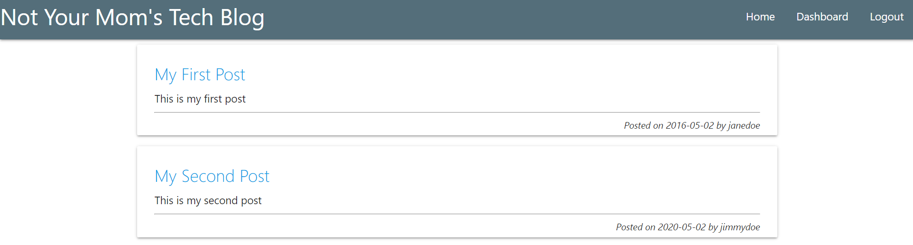

# Not-Your-Moms-Tech-Blog

## Description

This is a CMS-style blog site where developers can publish their blog posts and comment on other developers’ posts as well. The user can create an account, log in, create posts, comment on posts, update posts, and delete posts. The user can also log out.

## Table of Contents

- [Installation](#installation)
- [Usage](#usage)
- [Questions](#questions)
- [License](#license)

## Installation

To install necessary dependencies, run the following command:

`npm i`

All dependencies are listed in the package.json file.

## Usage

Visit the deployed application's link: <https://not-your-moms-tech-blog-5e4e2d95a074.herokuapp.com/>

To begin, click on the "Login" link in the navigation bar. If you do not have an account, click the "Sign Up" button. Enter a username and password, then submit this information. You will be redirected to the homepage. Click on the "Dashboard" link in the navigation bar to view any posts you have created. Click on the "New Post" button to write a new post. Enter a title and content for your post. Click the "Create Post" button. You will be redirected to the updated dashboard. Click on a post too view, edit, or delete your post. Click on the "Logout" button to log out of your account.

## Questions

If you have any questions about the repo, open an issue on the [Repository](https://github.com/SeeYouThursday/Not-Your-Moms-Tech-Blog). You can find more of my work at [SeeYouThursday](github.com/SeeYouThursday).

## License

This project is licensed under the MIT License.
